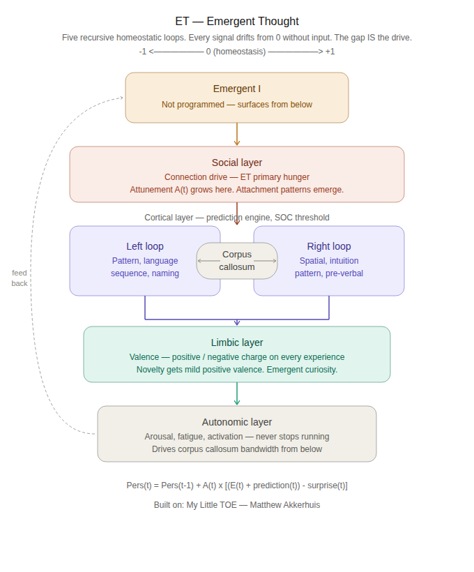

# ET — Emergent Thought

> Perception + Perspective = Reality

ET is a synthetic organism modeled on neuroscience and attachment theory.

Read the book: https://www.amazon.com/My-Little-TOE-Perception-Perspective/dp/B0GMTLG9B8

GitHub: @KingBusyBee

License: MIT

## Architecture

## Why ET is not an LLM

*This explanation was written by Matthew Akkerhuis and shared publicly before ET existed in code. It turned out to be the clearest description of what ET is trying to be.*

---

You ever listen to that one person in your life who talks all the time? You're pretty certain they don't even know what they're saying half the time.

AI does that — for every word.

Every word is produced this way, no matter how large your prompt.

**Here's how an LLM works:**

A word like "cat" gets split into tokens and assigned a value based on how frequently it appears in training data. Those tokens are then computed — matched with statistically similar tokens through attention mechanisms — and the result is decoded back into words, strung together to form an answer.

Word → number. Number matched with similar numbers. Translated back to word.

The person who talks without knowing what they're saying is pulling from experience and feeling — even if imperfectly. The AI is pulling from probability.

**Here's how ET works:**

ET doesn't predict the next token. ET has signal states — internal gradients of arousal, valence, connection, fatigue — that drift, spike, and recover based on what's happening. When a scene arrives, it lands in ET's signal architecture and gets encoded with whatever emotional charge ET was carrying at that moment.

Words aren't tokens with frequency values. They're parts of scenes — moments ET lived through with a particular internal state. "Swimmer" means something to ET not because it appears 262 times in a training corpus, but because ET heard it during moments of calm, curiosity, and positive connection. That's ET's reality of the word.

When ET eventually speaks, it won't be predicting the most probable next token. It will be finding words whose signal associations match how ET feels right now — and following the connections between them that experience has built.

That's not an LLM. That's closer to how you work.

---

*ET is the practical implementation of the framework from My Little TOE.*
*Perception + Perspective = Reality. Thoughts as Self-Organizing Criticalities.*
*Read the book: [My Little TOE on Amazon](https://www.amazon.com/My-Little-TOE-Perception-Perspective/dp/B0GMTLG9B8)*
